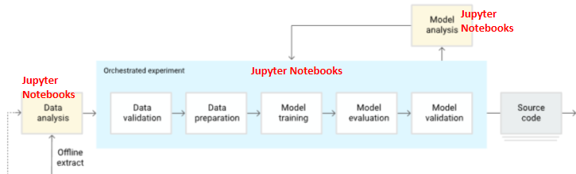

# Continuous Training (CT) pipeline in IRIS and MLflow

This is an integration of IRIS and the Open Source AI engineering platform MLflow acting as complementaty tools for a Continuous Training (CT) pipeline. For context, a CT pipeline is the formalization of a Machine Learning (ML) model developed through data science experimentations on the data available at the time, to be ready for deployment and autonomous updating with new data and appropriate performance monitoring.

This is a formal implementation of the CT pipeline for a toy example, you just manually draw some points and a linear regression is fit to predict new points (for "x", model predicts "y"). This will allow to test automatic execution of model drgradation and retraining of the model when you decide to change how you draw this points (slope, offset, dispersion, etc).


## Test The whole thing just by:


Building IRIS+MLflow instances

```
docker-compose up --build -d
```

Play with the jupyter notebook in
```
dur\tests\CT_Pipeline_testing.ipynb

note: in order for the widget to daw points to work, befor running following cells, click outside of the widget, and then draw one last point inside the widget.
```

See logged metrics and model registry in

```
http://localhost:5000/#/experiments
```

Access IRIS Management Portal in
```
http://localhost:52773/csp/sys/%25CSP.Portal.Home.zen
username: superuser
password: SYS
```

See all the logging exclusive to the pipeline in
```
dur\log\MLpipelineLogs.log
```

TODO: video showing how to execute.

## CT Pipeline Components


The theory behind the modules of this CT pipeline is based on the industry standard for MLOps level 1 defined by Google in https://docs.cloud.google.com/architecture/mlops-continuous-delivery-and-automation-pipelines-in-machine-learning?hl=en, and the implementation of each of its components leverages the best features of both IRIS and MLflow, highlighted in red as seen in the image below:


 
For those new to CT pipelines, the image above describes how a traditional experimentation phase of a Data Science project (upper section "experimentation/development/test"), usually done on jupyter notebooks, is transformed into a production grade deployment of the developed model  that allows for a continuous monitoring of its performance in time, and automatic retraining whenever the performance of the model degrades in time. All this with the appropriate registry of model versioning and logging for auditing purposes.

We will delve in to the details later, but for early understanding of each of the components, we will start by briefly defining what each of these do, and how that related to the IRIS/MLflow tool chosen for that purpose.

- Feature Store: Is the single source of truth for sourcing the data, and where every constant parameter or definition related to the data itself is defined, which might vary across clients and use cases. (e.g. each client might define readmission after 15, or 30 or else days. Late arrival to an appointment might be considered arriving after 5, 10, or else minutes). IRIS SQL Tables' multidimensional globals allows high-speed storage and stored computed properties eases the definition of custom properties along with the raw data itself.

- Automated Pipeline: Is the formalized and clearly modularized version of the "Orchestrated experiment" that's usually done in a jupyter notebook, that is prepared to be executed everytime the model has to be retrained if required. It contains every process on the data and for model training that is done in order to get the model with best performance overall. In this section every constant related to the model itself chosen during the experimentation phase (previously done by data scientists in jupyter notebooks) is defined (e.g. Seed, test size, K-folds for validation, etc). In our implementation, we leverage embedded python to easily access IRIS classes directly, along with all the required standard Machine Learning python libraries (PAndas, Sklearn, MLflow, etc).

- Model Registry: During Training, each model that is trained is logged into the MLflow's backend registry, automatically configured when building the project. We can at any moment re-download models from there and query performance of previous models.

- Trained Model: Though MLflow backend has an Artifact Store where the weights of all the model's trained are stored, this project additionaly saves the pickle file directly into a persistent location (Docker volume) for quickly loading when needed. In case these are deleted, they are downloaded and re-saved in the same location from the MLflow Artifact Store.

- Model Serving: This block is in charge of managing the model that is served to production. We store the path to the model's pickle file to be used in production into a IRIS global, which is what gets updated whenever necessary. In this repo we directly promote the new model if it performs better than the previous one, but in a real scenario, this might require human approval. We decided to store the path to the model in a global and not the model itself because doing that would imply additional processing time for serialization and deserialization of the python object, whereas text is faster and straightforward to read from a global regarless of classes in the whole repository, making it easy and fast to read anywhere.

- Prediction Service: Is the actual service than a client would use to request inferences on the current model set in production. At the moment this repo uses an embedded python method for this, but for this block, this can be potentially improved by transforming the model into PMML format to make the production service executable using Integrated ML for any SKlean models, or any python model like LightGBM uwing the upcoming IntegratedML custom models in IRIS 2026.1.

- Performance Monitoring: Is any sort of monitoring that can be made implemented to keep track of the performance of the current model in production, along with previous ones if necessary. For this we leverage MLflow's UI, where we can make custom plots with any of the variables logged, datetime, performance metrics, both for each model and for all models historically trained.

- Trigger: Is whatever activates the execution of the Automated Pipeline. When data drift is identified, model degrades until certain theshold, on availability on a certain amount of new data with enough ground truth, or simple scheduled every certain time. In this project we directly compare to a defined threshold of the R² metric, so every time performance falls below the value in MLpipeline.PerformanceMonitoring.R2THRESHOLD, we directly execute the automated pipeline. For this task, another valid approach would be use the task manager to schedule a method that looks at the performance registered during the perfrmance monitoring on MLflow tracking, and decide whether to retrain a new model.


## Docker Details

### [docker-compose.yml](docker-compose.yml)

has service for iris, and the backend that mlflow needs for model registry and performance tracking (MLflow server, Postgres, and MinIO).All MLflow-related state (metadata and artifacts such as models and metrics) is stored in the durable host-mounted directory dur/sandbox/mlflow.,Because this directory resides in the host filesystem and is bind-mounted, its contents persist across container restarts and are accessible outside the containers.

WARNING: a .env is in this project uploaded for testing purposes, but it should be added to the .gitignore to avoid sharing credentials in a real production environment

If during build, any of the container components for mlflow fail, retry commenting out all services except "iris" to create only the iris container through "docker-compose up --build -d" and manually start server (http://localhost:5000) in the desired folder by running 

```
mlflow server --port 5000
```

then you can Open http://localhost:5000 in your browser to view the UI.

### [dockerfile](dockerfile)

contains image requirements for IRIS with any needed configurations for Data Science projects (borrowed from https://github.com/JorgeIvanJH/IRIS-dockerization-for-Data-Science) for embedded python

### [iris_autoconf.sh](iris_autoconf.sh)

Contains all iris terminal comands to be executed after the container is up and running. This imports  objectscript packages, defines default username (SuperUser) and password (SYS) avoiding default password changing, populates initial tables, trains first model, deplots first model to production, makes first monitoring, and sets up structured logging to save logs related to this project to the persistent storage in dur\log\MLpipelineLogs.log


## Logging
This repo uses [Structured Logging](https://docs.intersystems.com/irislatest/csp/docbook/DocBook.UI.Page.cls?KEY=GCM_structuredlog) to log every relevant aspect of the operational health of the CT pipeline. The configuration set on the iris_autoconf.sh file to keep for the "INFO" level, only "Utility.Event" events creates with the form

do ##class(%SYS.System).WriteToConsoleLog(message, prefix, severity)

e.g:
    do ##class(%SYS.System).WriteToConsoleLog("This is my INFO CT Log", 0, 0)
    do ##class(%SYS.System).WriteToConsoleLog("This is my WARNING CT Log", 0, 1)
    do ##class(%SYS.System).WriteToConsoleLog("This is my SEVERE CT Log", 0, 2)

This logging system is used throughout the whole pipeline for auditing purposes, and though all these logs can be seen in the managemente portal at System Operation > System Logs > Messages Log, the configuration done during the docker build, lets us have a persistent version at [/dur/log/MLpipelineLogs.log](/dur/log/MLpipelineLogs.log), observable outside of the container, and in  JSON format for compatibility and any time analysis.


## Implementation Details

Below we explain, where and how is each of the CT pipeline components implemented in this repo.


### Experimentation




This phase refers to any experimentation done to train a first model using the data intially available from the Feature Store. For this project this block is represented in the jupyter notebook in [dur\sandbox\experiment.ipynb](dur/sandbox/experiment.ipynb), where we query the points available initially in the database, fit a first model, and compute performance metrics that we upload into a sepparate experiment in MLflow.

In the example just mentioned above we fit a sklearn linear regression on some points, and use a "with" clouse to log the whole training, model and metrics to MLflow. But for easier firt-time experimentation, also with models outside of sklearn you can connect MLflow to your experimentation just as shown below for a more complex dataset used to fit a LightGBM model, just by adding 2 additional lines of code:

```python
import os
import dotenv
import pandas as pd
from sklearn import datasets
from sklearn.model_selection import train_test_split
from sklearn.metrics import r2_score

import lightgbm as lgb
import mlflow
import mlflow.lightgbm

dotenv.load_dotenv()

mlflow.set_tracking_uri(os.environ["MLFLOW_TRACKING_URI"])
mlflow.set_experiment("MyLightGMB-experimentation") # 1: name of the experiment to identify in the UI

X, y = datasets.fetch_california_housing(return_X_y=True)
X_train, X_test, y_train, y_test = train_test_split(X, y, test_size=0.2, random_state=42)
params = {"n_estimators": 20, "learning_rate": 0.1, "max_depth": 50,"random_state": 42,
}
mlflow.lightgbm.autolog() # 2: Enable LightGBM autologging (would change for other libraries)

model = lgb.LGBMRegressor(**params)
model.fit(X_train, y_train, eval_set=[(X_test, y_test)], eval_metric="rmse")
```

And just like that we have full traceability of all the experiments we carry on. See below a short execise varying the number of extimators and max depth to reduce the rmse


Clicking each experiment, we can see more details, such as the training curve


Follow the code in [dur/tests/test_mlflow_connection.py](dur/tests/test_mlflow_connection.py) to verify the connection to MLflow.

You can load previously trained models, whose artifacts are stored in MLflow's Artifact store, by using the run id as done in [dur/tests/test_mlflow_loadmodel.py](dur/tests/test_mlflow_loadmodel.py). Note: This process takes some time, which is why in our implementation we also manually store the model weights for faster future loading.

For more information check the Quickstart for Data Scientists: https://mlflow.org/docs/latest/ml/getting-started/quickstart/

Guide for automatic hyperparameter optimization using optuna, and mlflow for tracking: https://mlflow.org/docs/latest/ml/getting-started/hyperparameter-tuning/


### Feature Store


Implemented in [MLpipeline\FeatureStore.cls](MLpipeline\FeatureStore.cls), there we define as Parameters of the MLpipeline.FeatureStor class any constant pertinent to the data itself to be easily referenced, and also the methods to upload and query all the tables required for the project. 

The MLpipeline.PointSample and MLpipeline.Predictions persistent classes point to the IRIS tables storing the raw data, and relevant metadata about the predictions done by the model

In this repo we include the required methods for querying from DB, and Parameterts (unchangeable at runtime) are set in stone here.

### Automated Pipeline


Implemented in [MLpipeline\AutomatedPipeline.cls](MLpipeline\AutomatedPipeline.cls), there we define as Parameters of the MLpipeline.FeatureStor class any constant pertinent to the model itself to be easily referenced, and also one method for each of the components that it involves, that are executed through the RunPipeline method in the same class. These steps are described in detail below:

1) ```Method DataExtraction(datetimestr As %String)```:
Leverages the FeatureStore to query the PointSamples table filtered by a takins all samples a certain datetime threshold using IRIS SQL, and converts the resulting %SYS.Python.SQLResultSet into a pandas DataFrame.
 - In: datetime filter string
 - Process: SQL query via FeatureStore's ```Method DataExtraction```
 - Out: Pandas DataFrame

2) ```Method DataValidation(df As %SYS.Python)```:
Inspects the DataFrame for data quality issues and logs warnings to the IRIS console: missing values, missing essential columns, incorrect data types, and IQR-based outlier detection. The DataFrame is passed through unchanged.
 - In: DataFrame
 - Process: Missing values, column, type and outlier checks
 - Out: DataFrame

3) ```Method DataPreparation(df As %SYS.Python)```:
Applies any transformations needed on the data, but only those that do not require any sort of model fitting (no .fit() calls such as scaling, or value inputting), such as renaming, or type casting. Then splits the data into train and test sets using train_test_split with the TESTSIZE and SEED paremeters of the same class defined when it is instantiated.
 - In: DataFrame
 - Process: Non-learned transforms + train/test split
 - Out: Xtrain, Ytrain, Xtest, Ytest

4) ```Method ModelTraining(Xtrain As %SYS.Python, Ytrain As %SYS.Python, params As %DynamicObject = "")```:
Contains all the trainable steps to be fitted in order to train using only the training batch extracted during the data preparation to avoid data leakage misleading effects. Here we do include every process that requires fitting such as value inputting or normalization. For the purposes of this toy example we only considered using sklearn's StandardScaler and LinearRegression. The training metrics achieved are logged to the current MLflow run ID, and the weights of the model are locally saved to the path defined in the parameter "MODELSPATH" of the same class for quick future loading (though the models can be re downloaded from MLflow anytime that's needed, but that takes some time loading).
 - In: Xtrain, Ytrain, model parameters
 - Process: sklearn Pipeline fit + MLflow logging
 - Out: trained model

5) ```Method ModelEvaluation(model As %SYS.Python, Xtest As %SYS.Python, Ytest As %SYS.Python)```:
Runs inference on the test split and logs the metrics achieved on the validation dataset over the same MLflow run. This method also has included methods to compute and store in MLflow custom metrics and plots. The metrics with the validation split are returned in the form of a dictionary. 
 - In: trained model, Xtest, Ytest
 - Process: inference on test splits + MLflow logging
 - Out: metrics dict

6) ```Method ModelValidation(newmodelmetrics As %SYS.Python, result As %SYS.Python, plotComparison As %Boolean = 1)```:
Fetches the current model deployed in production and compares its performance to the same test set used to evaluate the newly trained model. Then returns the MLflow run id according to the model with the best performance metrics. In this case only R² and MAE are considered. Draws a plot comparing inference of both models
 - In: new model metrics, result
 - Process: Compares performance between new and on-production models, draws inference plots.
 - Out: run_id of best model

### Model Serving


Implemented in [MLpipeline\ModelServing.cls](MLpipeline\ModelServing.cls), there we have methods to promote the model to production, according to the MLflow run id with the best performance on the selected metrics. The promotion is done by overwriting the path to the weights of the model that is stored on the global ```^ML.Config("ModelPath")```


### Prediction Service


Implemented in [MLpipeline\PredictionService.cls](MLpipeline\PredictionService.cls), the Predict method takes in any filters for which a prediction want's to me made with the current model in production. This filters are used to extract the values from database, and over which the prediction is done. The resulting prediction, along with other metedata of interest (modelrunid, inference time, datetime of inference) is stored in a table containing all this information for each of the points in the raw data table to which it is connected using foreign keys.

### Performance Monitoring and Trigger


Implemented in [MLpipeline\PerformanceMonitoring.cls](MLpipeline\PerformanceMonitoring.cls), there we query both the source data tables and the predictions tables, we filter the source rows that have ground truth in it, and use it along with the predictions made by the model to compute performance metrics that we log directly to a separate Experiment exclusively for live monitoring in MLflow. the ```Trigger(r2 as %Numeric)``` method is what directly executed the automated pipeline whe the performance of the model falls below a predefined threshold.

