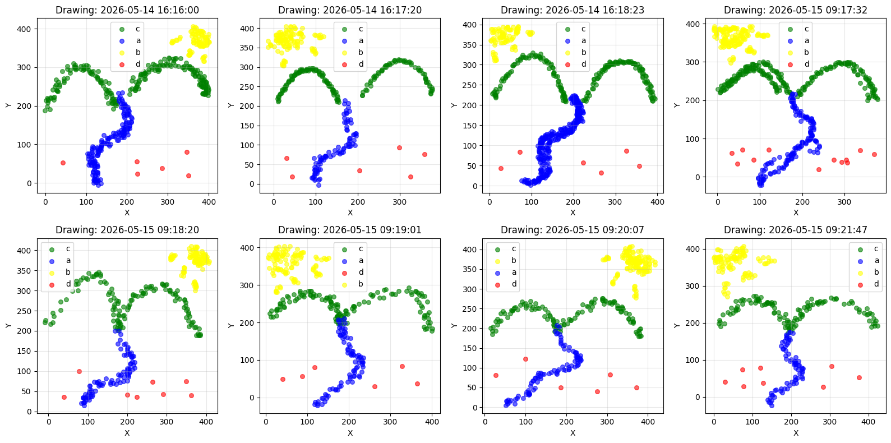
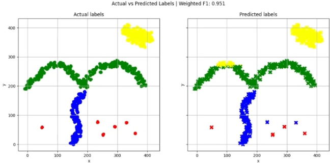
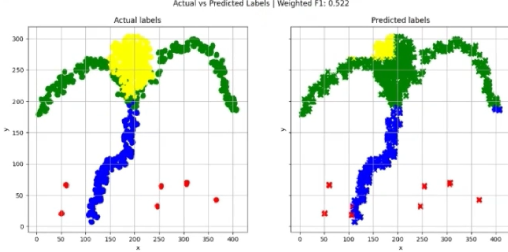

# Continuous Training (CT) pipeline in IRIS and MLflow (with SHAP explainability and Optuna Fast Automatic Hyperparameter tuning)

This is an integration of IRIS and the Open Source AI engineering platform MLflow, acting as complementary tools for a Continuous Training (CT) pipeline. For context, a CT pipeline is the formalization of a Machine Learning (ML) model developed through data science experimentation on the data available at the time, so it is ready for deployment, autonomous updating with new data, and appropriate performance monitoring. The implementation in this repo leverages MLflow's builtin configuration to store [SHAP](https://shap.readthedocs.io/en/latest/) explainers to provide explanations behind the predictions made by the corresponding model made at the time, including "black-box" complex ones such as Random Forest, XGBoost, Neural Networks, etc.

This is an extended version from the previous release [v0.1.0](https://github.com/JorgeIvanJH/IRIS_and_MLflow-Continuous-Training-Pipeline/tree/v0.1.0), where the challenge was to maintain up to date linear regression model on some points that were manually drawn, by retraining with new points a model whose hyperparameters remained static. In this version the Continuous Training pipeline was updated for a much more complex problem, and we added support for fast automatic retuning the model hyperparameters using [Optuna](https://optuna.org/) to update the model configuration, along with appropriate cross-validation evaluation  techniques to ensure having the best possible model to be fit to new samples while also ensuring avoiding overfitting.

## Explanation of the toy example

This is a formal implementation of the CT pipeline for a toy example for a classification problem, where the initial training dataset consists of manually drawn images like the ones shown in the image below. each image is drawn with points in the x and y axis, each colour having an associated class (colour). And the model trained on this dataset should be able to predict the right class (colour), based only on the x and y coordinates. This is a particularly challenging classification problem because the classes are havily unbalanced (number of points in class "d" or "red colour" are much less than any of the rest of the other classes), and the presence of groups in the dataset (each point, with its x and y axis values are represented as rows in a table, but points belonging to the same drawing should not be sepparated or mistakenly be shuffled with points belonging to different drawings), making the process of splitting the samples into training, validation and testing sets for an appropriate cross-validation technique not straightforward, we will delve more into the details of this later.



The model this example uses is the LightGBM gradient boosted approach, whose hyperparameters like tree depth, learning rate, number of leaves, etc, will be automatically tuned using Optuna and an appropriate cross-validation technique to avoid overfitting to one single training split, instead of having them constant. After a first version of the model is being trained, it could be tested with new manually drawn samples



And because of the flexibility in the input, we can simulate data shift by changing the drawing made, making the model trained on the dataset above to fail when the input changes significantly. 




## Requirements

- Docker desktop
- Having a valid InterSystems IRIS key (iris.key) placed in the root of the repository # TODO: see if can be ommited
- Notebook tested with Python 3.12

## Test The Whole CT pipeline By:


Building IRIS+MLflow instances

```
docker-compose up --build -d
```

Play with the jupyter notebook in [dur/tests/CT_Pipeline_testing.ipynb](dur/tests/CT_Pipeline_testing.ipynb)

Note: in order for the point-drawing widget to work, before running the following cells, click outside of the widget and then draw one last point inside it.

Warning: Use os.getenv("TZ") for all datetime objects to match the Docker environment. When querying IRIS, strip the timezone offset (use .strftime("%Y-%m-%d %H:%M:%S")) to avoid SQL validation errors.

See logged metrics and model registry in [http://localhost:5000/#/experiments](http://localhost:5000/#/experiments)

Access IRIS Management Portal in 
[http://localhost:52773/csp/sys/%25CSP.Portal.Home.zen](http://localhost:52773/csp/sys/%25CSP.Portal.Home.zen)

with credentials:

- username: SuperUser
- password: SYS

See all the logging exclusive to the pipeline in dur/log/MLpipelineLogs.log

Demo: TODO: record new demo


## Explanation of components in the CT pipeline

Refer to [README](MLpipeline\README.md) for detailed explanation

## Unit Tests TODO: Update unit testing

This project now includes isolated unit tests for `python_utils/utils.py` in `tests/unit/test_utils_unit.py`.
These tests mock IRIS and MLflow interactions so they can run without a live IRIS instance.

Install dependencies and run the unit test suite:

```bash
pip install -r requirements.txt
pytest tests/unit -q
```


## Docker Details

### [docker-compose.yml](docker-compose.yml)

Has service for IRIS, and the backend that MLflow needs for model registry and performance tracking (MLflow server, Postgres, and MinIO). All MLflow-related state (metadata and artifacts such as models and metrics) is stored in the durable host-mounted directory dur/sandbox/mlflow. Because this directory resides in the host filesystem and is bind-mounted, its contents persist across container restarts and are accessible outside the containers.

WARNING: a .env is in this project for testing purposes, but in a real production environment it should be excluded from version control to avoid sharing credentials.

### [Dockerfile](Dockerfile)

Contains image requirements for IRIS with needed configurations for Data Science projects borrowed from [IRIS-dockerization-for-Data-Science](https://github.com/JorgeIvanJH/IRIS-dockerization-for-Data-Science) for embedded python

### [iris_autoconf.sh](iris_autoconf.sh)

Contains all IRIS terminal commands to be executed after the container is up and running. This imports ObjectScript packages, unexpires the default username (SuperUser) and password (SYS) to avoid forced password changes, populates initial tables, trains the first model, deploys the first model to production, runs first monitoring, and sets up structured logging to save logs related to this project to persistent storage in dur/log/MLpipelineLogs.log.


## Logging
This repo uses [Structured Logging](https://docs.intersystems.com/irislatest/csp/docbook/DocBook.UI.Page.cls?KEY=GCM_structuredlog) to log every relevant aspect of the operational health of the CT pipeline. The configuration set in [iris_autoconf.sh](iris_autoconf.sh) keeps, for the "INFO" level, only "Utility.Event" events created with the form

do ##class(%SYS.System).WriteToConsoleLog(message, prefix, severity)

e.g:
    do ##class(%SYS.System).WriteToConsoleLog("This is my INFO CT Log", 0, 0)
    do ##class(%SYS.System).WriteToConsoleLog("This is my WARNING CT Log", 0, 1)
    do ##class(%SYS.System).WriteToConsoleLog("This is my SEVERE CT Log", 0, 2)

This logging system is used throughout the whole pipeline for auditing purposes, and though all these logs can be seen in the management portal at System Operation > System Logs > Messages Log, the configuration done during the docker build lets us have a persistent version at [dur/log/MLpipelineLogs.log](dur/log/MLpipelineLogs.log), observable outside of the container and in JSON format for compatibility and time analysis.


## Optuna

Now with Optuna we can also update hyperparameters in the data, not just the same model over new data
e.g:
    if we are limited to linear regression (polimonial regression with order of 1) and the points begin to have curves, it will be impossible to fit a line that represents the pattern of the points. but if we can update the degree of the polinomial features, we can fit a line better to the new points

TODO: Stop relying on STORAGE_URL = "sqlite:///optuna_lgbm.db" 

## Cross Validation SELECTION (VERY IMPORTANT)

IMPORTANT!!! Groups in this new exercise: Points belonging to the same group shall not be split (Datetime acts as identificator for the drawing): StratifiedGroupKFold   (groups exist, classification w imbalanced groups)

## NEW FUTURE WORK
- Add plugin for IRIS, and stop using additional DB for backend storage. Guide here: https://mlflow.org/docs/latest/ml/plugins?utm_source=chatgpt.com   

TODO: Add support in MLflow for storing in IRIS the metrics

## Future Work


- In this project, when prediction performance falls below a predefined threshold, the model is retrained and automatically updated. However, in some cases, human approval should be required before making changes in production, which is something that should be considered